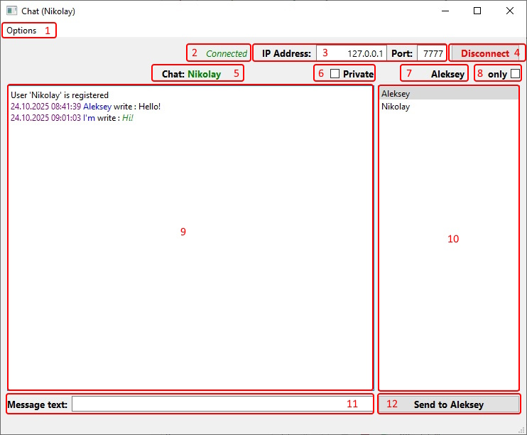
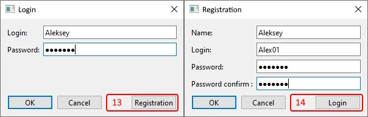
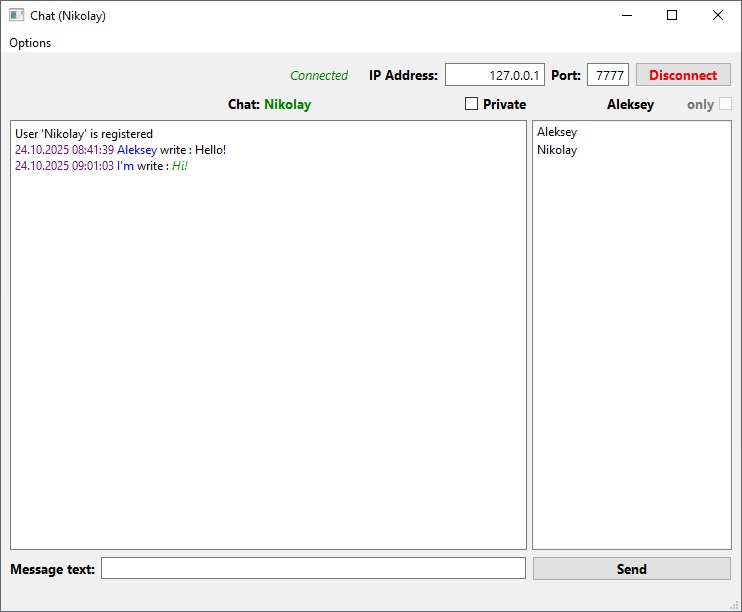

# KDV.Qt_Chat-36_7-PJ-Client 

## Итоговый проект PJ (36.7)

- ОС             : Windows 10 Домашняя 22H2
- IDE            : Qt Creator 17.0.1 (Qt 6.9.3 MSVC2022_64bit Версия 17.14.15)
- C++            : 20
- База данных    : QSqlDatabase SQLite
- TCP сервер     : QTcpServer
- TCP клиент     : QTcpSocket
- Интерфейс      : графический (Qt)
- Принцип работы : сервер-клиент

Разработчик: Дмитрий Кучуро

### Итоговый проект курса "Разработчик на С++".
Клиент-серверный чат с подключением через ТСР-сервер, хранением данных в базе данных.

Реализованы основные требования к проекту.

### В клиентской части реализовано:

- Настройка параметров подключения к серверу
- Регистрация и авторизация пользователя
- Пароль хешируется
- В логине и имени разрешены только буквы латинского алфавита, цифры и нижний слэш
- В тексте запрешены символы '#' и '|', так как используются в парсинге данных
- Отправка персональных и общих сообщений
- Прием сообщений
- Фильтрация сообщений по пользователю и приватности 
- При блокировке пользователя блокируется возможность отправки сообщений

### Назначение элементов главного окна клиента:

1. Меню опций (аутентификация, регистрация, выход из профиля, завершение программы).
2. Статус соединения с сетью.
3. Параметры сети.
4. Кнопка подключения к сети / отключения от сети.
5. Отображение имени авторизованного в данный момент пользователя.
6. Флаг отображения персональных сообщений. Может использоваться совместно с флагом Users only.
7. Имя выбранного пользователя.
8. Флаг отображения сообщений выбранного пользователя. Может использоваться совместно с флагом Private only.
9. Окно чата.
10. Окно списка пользователей.
11. Строка ввода сообщения.
12. Кнопка отправки сообщения всем или выбранному пользователю.

13. Кнопка перехода к регистрации.
14. Кнопка перехода к аутентификации.

